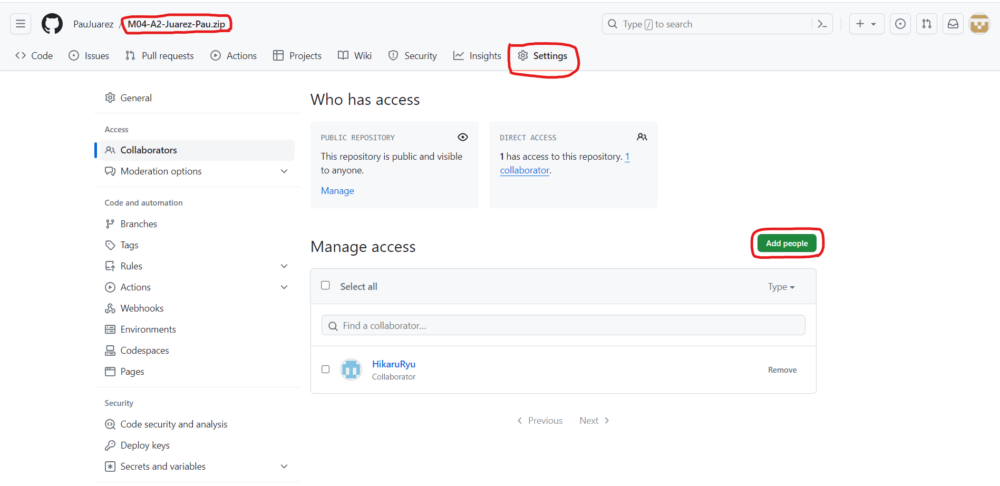
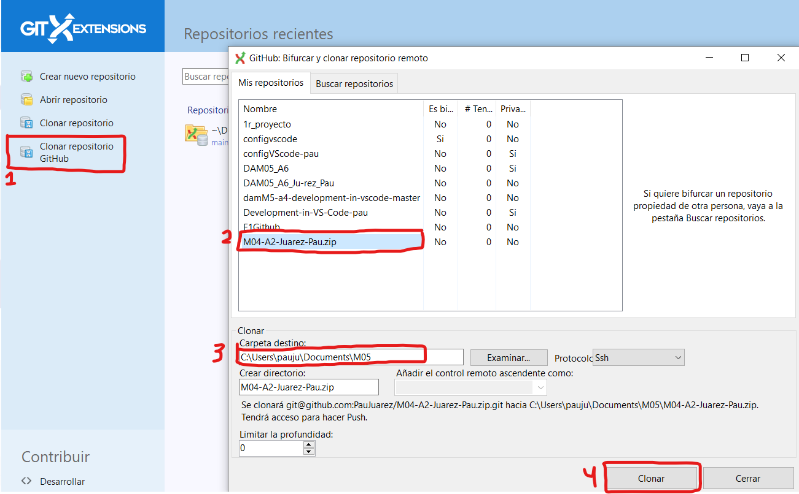

## Initial configuration GitHub

1. **Repository Configuration:**
   - Configure the repository to allow collaboration: `Settings -> Collaboration -> Add people`.
   
   - PD: It doesn't matter if it's public or private.
    

## Trabajo individual

2. **Clone the Repository Locally:**
   - Use Git Extensions to clone the repository to your local machine.
    
    1. Click on "Clone repository from GitHub," and it will prompt for a token, but I already had it from a few months ago.
    2. Choose the repository.
    3. Select the directory where you want it to be saved.
    4. Clone it.
